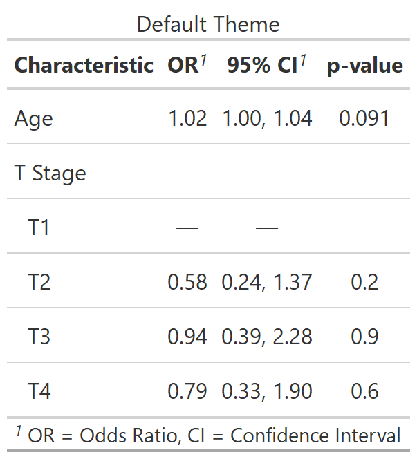
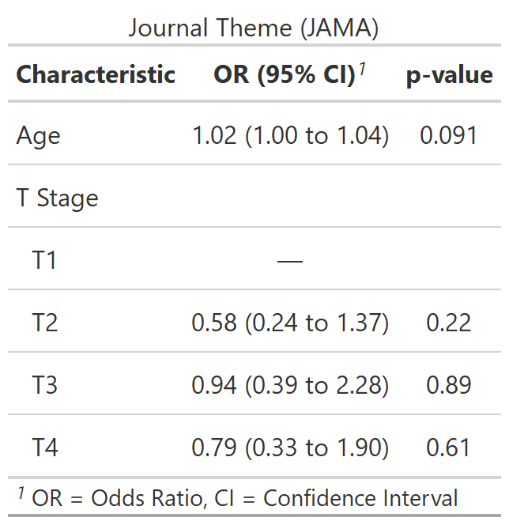
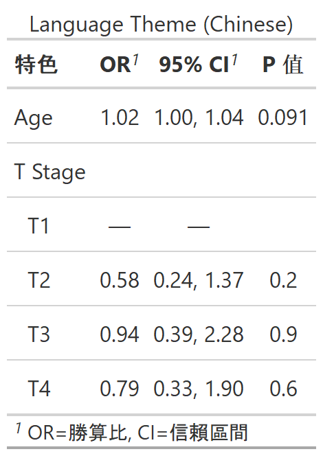

class: inverse, center, middle
# {gtsummary} themes

---
# {gtsummary} theme basics

.large[
- A **theme** is a set of customization preferences that can be easily set and reused. 

- Themes control **default settings for existing functions**

- Themes control more **fine-grained customization** not available via arguments or helper functions

- Easily use one of the **available themes**, or **create your own**
]


---
# {gtsummary} default theme

.pull-left[

```{r results=FALSE}
reset_gtsummary_theme()

no_theme <- 
  tbl_regression(m1, exponentiate = TRUE) %>%
  modify_caption("Default Theme")
```

```{r include = FALSE}
my_gtsave("no_theme")
```
]

.pull-right[
<p align="center"></p>
]


---
# {gtsummary} theme_gtsummary_journal()

.pull-left[

```{r results=FALSE, message = FALSE}
reset_gtsummary_theme()

theme_gtsummary_journal(journal = "jama")

jama_theme <- 
  tbl_regression(m1, exponentiate = TRUE) %>%
  modify_caption("Journal Theme (JAMA)")
```

```{r include = FALSE}
my_gtsave("jama_theme")
```

]

.pull-right[
<p align="center"></p>
]

.medium[
Contributions welcome!
]


---
# {gtsummary} theme_gtsummary_language()

.pull-left[
```{r results=FALSE, message = FALSE}
reset_gtsummary_theme()

theme_gtsummary_language(language = "zh-tw")

lang_theme <- 
  tbl_regression(m1, exponentiate = TRUE) %>%
  modify_caption("Language Theme (Chinese)")
```

```{r include = FALSE}
my_gtsave("lang_theme")
```

]


.pull-right[
<p align="center"></p>
]

.medium[
Language options: "de" (German), "en" (English), "es" (Spanish), "fr" (French), "gu" (Gujarati), "hi" (Hindi), "is" (Icelandic),"ja" (Japanese), "kr" (Korean), "mr" (Marathi), "pt" (Portuguese), "se" (Swedish), "zh-cn" (Chinese Simplified), "zh-tw" (Chinese Traditional)
]


---
# {gtsummary} theme_gtsummary_compact()

.pull-left[
```{r results=FALSE, message = FALSE}
reset_gtsummary_theme()

theme_gtsummary_compact()

compact_theme <- 
  tbl_regression(m1, exponentiate = TRUE) %>%
  modify_caption("Compact Theme")
```

```{r include = FALSE}
my_gtsave("compact_theme")
```
]

.pull-right[
<p align="center"></p>
]

.medium[
Reduces padding and font size
]


---
# {gtsummary} set_gtsummary_theme()


.large[
* `set_gtsummary_theme()` to use a custom theme.

* See the {gtsummary} + themes vignette for examples

http://www.danieldsjoberg.com/gtsummary/articles/themes.html
]


